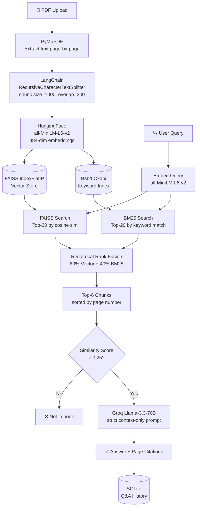

# 📚 EduRAG — Class 1–12 Textbook Q&A Assistant

> Upload any NCERT or school textbook PDF and ask questions from it.
> Answers come **strictly from the book** — no hallucinations, no external knowledge.


---

## 🎯 What is EduRAG?

EduRAG is a **Retrieval-Augmented Generation (RAG)** system built for students.
You upload a textbook PDF (Class 1–12), and the system indexes it.
Ask any question — the AI searches the book, retrieves the most relevant sections,
and answers with **page citations**. If the answer isn't in the book, it says so.

---

## ✨ Features

- 📤 **Upload any PDF** — NCERT, state board, reference books, anything
- 🔍 **Hybrid Search** — Vector similarity (FAISS) + Keyword search (BM25) combined via Reciprocal Rank Fusion
- 📄 **Page Citations** — Every answer includes the page numbers it came from
- 🚫 **Strict RAG** — Two-layer hallucination prevention (similarity threshold + strict LLM prompt)
- ⚡ **Query Caching** — Repeated queries answered instantly without API calls
- 🗂️ **Multi-book Support** — Index multiple books, switch between them in chat
- 📊 **Q&A History** — All queries + answers saved to SQLite, exportable as CSV
- 🖼️ **Diagram Awareness** — Detects diagram pages; captions and surrounding text indexed
- 🌙 **Dark UI** — Professional Next.js frontend with Tailwind CSS

---

## 🏗️ Architecture



---

## 🛠️ Tech Stack

### Backend
| Tool | Purpose |
|------|---------|
| **FastAPI** | REST API server |
| **PyMuPDF (fitz)** | PDF text + image extraction |
| **LangChain** | RecursiveCharacterTextSplitter for chunking |
| **sentence-transformers** | `all-MiniLM-L6-v2` embeddings |
| **FAISS** | Vector similarity search (IndexFlatIP) |
| **rank-bm25** | BM25Okapi keyword search |
| **Groq API** | Llama-3.3-70B LLM inference |
| **SQLite** | Q&A history persistence |
| **python-dotenv** | Environment variable management |

### Frontend
| Tool | Purpose |
|------|---------|
| **Next.js 14** | React framework (App Router) |
| **TypeScript** | Type safety |
| **Tailwind CSS** | Styling |
| **react-markdown** | Render LLM markdown responses |
| **lucide-react** | Icons |
| **react-hot-toast** | Notifications |

---

## 📁 Project Structure
```

edurag/

├── backend/

│   ├── main.py            ← FastAPI app + all REST endpoints

│   ├── rag_pipeline.py    ← Core RAG: extract → chunk → embed → index → retrieve → generate

│   ├── database.py        ← SQLite Q&A history (save, fetch, delete, export)

│   ├── config.py          ← All constants (chunk size, thresholds, model names)

│   ├── requirements.txt

│   ├── .env               ← GROQ_API_KEY goes here (not committed)

│   └── indexes/           ← FAISS indexes saved here per book

│       └── Class10_Mathematics_NCERT/

│           ├── index.faiss

│           ├── chunks.json

│           └── metadata.json

│

└── frontend/

├── src/

│   ├── app/

│   │   ├── page.tsx           ← Dashboard

│   │   ├── upload/page.tsx    ← Upload + process books

│   │   ├── chat/page.tsx      ← Q&A chat interface

│   │   └── history/page.tsx   ← Saved Q&A history + CSV export

│   ├── components/

│   │   └── Sidebar.tsx

│   └── lib/

│       └── api.ts             ← All API calls to backend

├── next.config.mjs

└── tailwind.config.ts


```

## 🚀 Local Setup

### 1. Prerequisites
```
- Python 3.10+
- Node.js 18+
- Free Groq API key → [console.groq.com](https://console.groq.com)

### 1. Clone the repo
```bash
git clone https://github.com/yourusername/edurag.git
cd edurag
```

### 2. Backend setup
```bash
cd backend
pip install -r requirements.txt
```

Create `backend/.env`:

Start backend:
```bash
uvicorn main:app --reload --port 8000
```

### 3. Frontend setup
```bash
cd frontend
npm install
npm run dev
```

Open [http://localhost:3000](http://localhost:3000)

---

## 📖 How to Use

1. **Upload a book** → Go to Upload page → Select Class, Subject, Book Name → Drop PDF → Click "Process Book"
   - Processing takes 2–5 minutes for large books (embeddings generation)
   - Book is indexed and saved permanently to `backend/indexes/`

2. **Chat** → Go to Chat page → Select book from dropdown → Ask any question
   - Answers include page citations e.g. `(Source: Page 34, Page 35)`
   - Off-topic queries are flagged instantly without calling the LLM

3. **History** → View all past Q&A → Search by query or book → Export as CSV

---

## 📥 Where to Get NCERT PDFs

| Source | Type |
|--------|------|
| [ncert.nic.in/textbook.php](https://ncert.nic.in/textbook.php) | Official — chapter-wise |
| [ncertbooks.guru](https://ncertbooks.guru/ncert-books-pdf/) | Merged full books |
| [vedantu.com/ncert-books](https://www.vedantu.com/ncert-books) | Merged full books |

To merge chapter PDFs → [ilovepdf.com/merge_pdf](https://www.ilovepdf.com/merge_pdf)

---

## 🔧 Configuration

All tunable constants in `backend/config.py`:

| Setting | Default | Description |
|---------|---------|-------------|
| `CHUNK_SIZE` | 1000 | Characters per chunk |
| `CHUNK_OVERLAP` | 200 | Overlap between chunks |
| `SIMILARITY_THRESHOLD` | 0.25 | Min cosine score (below = "not in book") |
| `FAISS_TOP_K` | 20 | Candidates from vector search |
| `BM25_TOP_K` | 20 | Candidates from keyword search |
| `FINAL_TOP_K` | 6 | Chunks sent to LLM after reranking |
| `VECTOR_WEIGHT` | 0.6 | RRF weight for vector search |
| `BM25_WEIGHT` | 0.4 | RRF weight for BM25 search |

---

## 🛡️ Hallucination Prevention

Two layers ensure answers come **only from the book**:

**Layer 1 — Similarity Threshold:** If best cosine score < 0.25, query flagged as out-of-scope before LLM call. Zero API cost, instant response.

**Layer 2 — Strict System Prompt:** LLM instructed to answer ONLY from provided context. Temperature = 0.05 for maximum factual consistency. LLM must cite page numbers.

---

## 📊 About Diagram Support

| Content Type | Indexed? |
|-------------|----------|
| Text labels and captions on diagram pages | ✅ Yes |
| Explanatory text surrounding diagrams | ✅ Yes |
| Pure rasterized image diagrams | ❌ No (pixels not embedded) |

Full multimodal diagram search (CLIP-based image embeddings) is a planned future enhancement.

---

## 🗺️ Roadmap

- [ ] Multimodal diagram search (CLIP embeddings)
- [ ] Streaming LLM responses
- [ ] Hindi textbook support
- [ ] Docker deployment
- [ ] User authentication

---

## 👤 Author

**Dhruv Singh**
- GitHub: [@kunwardhruv](https://github.com/kunwardhruv)
- Email: kunwarrdhruv@gmail.com

---

## 📄 License

MIT License — free to use, modify, and distribute.
